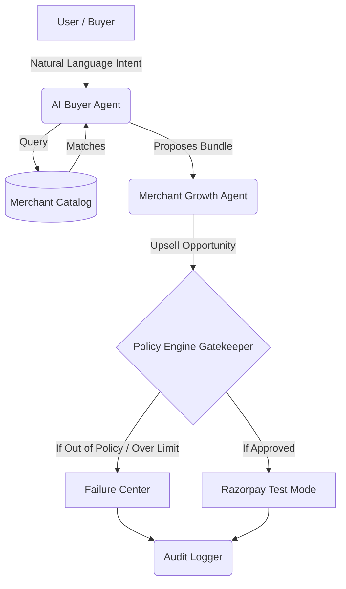

# System Architecture

The Agentic Commerce system is designed around a strict separation of concerns between **Intent/Discovery (AI)** and **Transaction Execution (Deterministic Policy)**. 

## Architectural Philosophy
Large Language Models (LLMs) are probabilistic by nature. They are excellent at parsing unstructured buyer intent, matching catalog items, and orchestrating merchant growth opportunities. However, they cannot be trusted to independently execute financial transactions. 

Therefore, our architecture implements a **Policy Gate**.

## Core Modules

### 1. The Buyer Flow (`components/buyer-flow.tsx`)
This is the entry point for the user. It captures natural language (e.g., *"Find me a coding laptop under ₹50K"*), sends it to the Gemini-powered AI, and deterministically ranks the matching catalog items based on extracted structured intent.

### 2. The Policy Engine (`lib/policy/policy-engine.ts`)
The core safeguard of the application. It acts synchronously.
- Takes the proposed cart, the item costs, and the user's intent.
- Checks against hard-coded deterministic rules (e.g., `Max Transaction Limit: ₹50,000`, `Minimum Merchant Margin: 5%`).
- Returns a `PolicyEvaluation` state: `APPROVED`, `PENDING_USER`, or `POLICY_BLOCKED`.
- **The LLM cannot override this engine under any circumstance.**

### 3. Razorpay Integration (`components/razorpay-payment.tsx`)
Handles the actual transaction only after the Policy Engine returns an `APPROVED` state. It securely creates an order and initializes the Razorpay Checkout modal in Test Mode.

### 4. Audit & Transparency (`components/audit-events.tsx`)
Every critical action in the system is dispatched to a global context (`policy-provider.tsx`) using the `record()` function. This creates an immutable, append-only log viewable in the UI, proving exactly *why* an action occurred, who did it, and what policy was applied.

### 5. Failure Handling (`components/failure-events.tsx`)
Instead of crashing or throwing opaque 500 errors, when the Policy Engine blocks an AI proposal (e.g., trying to buy an ₹80K gaming setup when the limit is ₹50K), the event is caught, explained gracefully to the user, and logged as an intercepted threat.
